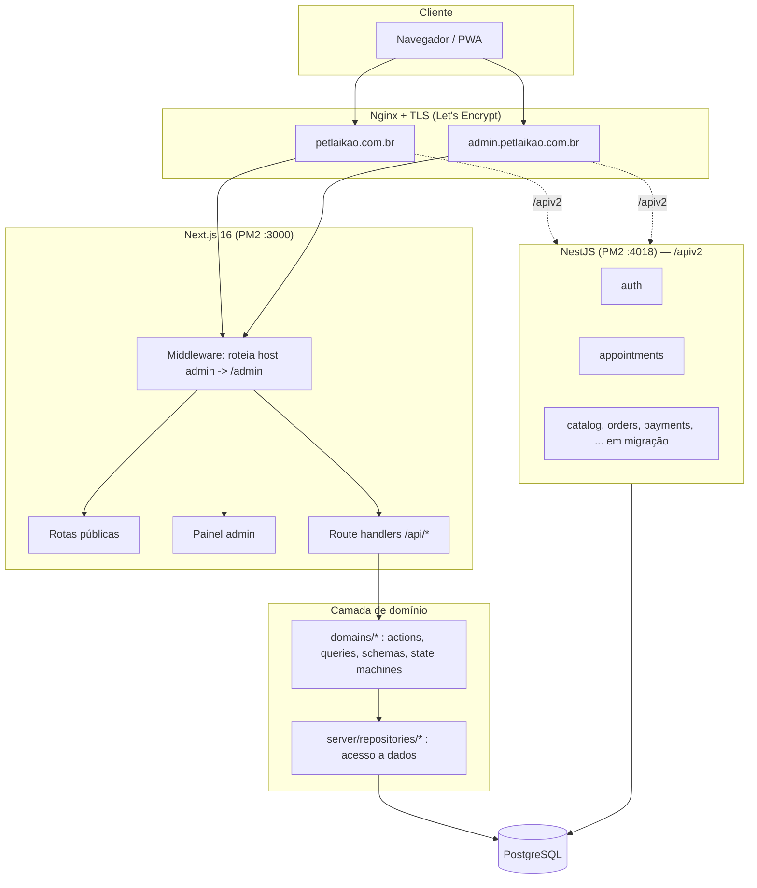

<div align="center">

# 🐾 Pet Shop Laikão

### Plataforma comercial completa para um pet shop de bairro: loja, agenda, pagamentos, admin e PWA.

**_Paixão que une, amor que cuida._**

[](https://nextjs.org/)
[](https://react.dev/)
[](https://www.typescriptlang.org/)
[](https://nestjs.com/)
[](https://www.prisma.io/)
[](https://www.postgresql.org/)
[](https://tailwindcss.com/)
[](#pwa)

🌐 **Site:** [petlaikao.com.br](https://petlaikao.com.br) &nbsp;·&nbsp; 🔒 **Admin:** [admin.petlaikao.com.br](https://admin.petlaikao.com.br)

</div>

---

## ✨ Sobre o projeto

O **Pet Shop Laikão** é uma loja de bairro na Vila Nova Cachoeirinha (Zona Norte de São Paulo). Este repositório é a plataforma digital completa da marca, construída do zero com foco em **experiência mobile**, **identidade visual forte** e **operação real** (não é um template ou landing page).

Não é "site de pet shop simples": é uma **plataforma comercial** no patamar de uma rede grande, com identidade própria, agenda séria, e-commerce, pagamentos, admin robusto e uma API própria em evolução.

### Por que este projeto é interessante tecnicamente

- 🏗️ **Arquitetura em camadas e orientada a domínio** dentro do Next.js (rotas HTTP → domínios → repositórios → Prisma), pronta para extração em microsserviços.
- 🧩 **Migração incremental para API própria (NestJS)** sem big bang e sem derrubar o que está no ar.
- 📅 **Agenda com máquina de estados, holds temporários e regras de disponibilidade.**
- 🌐 **Roteamento por subdomínio** (site público e painel admin servidos pela mesma app, separados por middleware).
- 📱 **PWA instalável**, mobile-first de verdade (a partir de 360px).
- 🎨 **Design system próprio** (rosa + roxo, tipografia Baloo 2 + Nunito) reproduzido fielmente a partir de uma referência aprovada.

---

## 🚀 Funcionalidades

### Loja e cliente (público)
- **Home** comercial com herói, selo de marca, prova social ("Atendida pela Cris") e CTAs claros.
- **Serviços** (banho e tosa, terapêutico, tosa higiênica) com preço, duração e página de detalhe.
- **Agenda online** com calendário, disponibilidade real e confirmação.
- **Vitrine de produtos** com busca, categorias, ordenação e estados vazios honestos.
- **Página de produto**, **carrinho** e **checkout** (integração de pagamento via InfinitePay).
- **Promoções** que nunca aparecem vazias (vantagens fixas + campanhas + "em breve").
- **Contato** com WhatsApp, Instagram, mapa Google embed e nota de LGPD.
- **Páginas legais** (privacidade, termos, trocas, política de agendamento) e **consentimento de cookies**.

### Painel administrativo (subdomínio `admin.`)
- **Autenticação real** (sessão com cookie httpOnly, hash de senha pbkdf2, lockout por tentativas).
- Gestão de **agendamentos, pedidos, produtos, categorias, serviços, estoque, precificação, promoções, financeiro, relatórios e notificações**.
- Princípio: **nunca exibir dado fake como real** — ou dado real, ou estado vazio elegante.

---

## 🧱 Arquitetura



**Estratégia de evolução:** o Next.js segue como frontend e dono das rotas atuais; a **API NestJS** sobe em paralelo (porta 4018, exposta em `/apiv2`) e assume os domínios **rota a rota** — começando por `auth` e `appointments` — compartilhando o **mesmo schema Prisma** e a **mesma sessão** (cookie + tabela), sem quebrar produção.

---

## 🛠️ Stack

| Camada | Tecnologias |
|---|---|
| **Frontend** | Next.js 16 (App Router), React 19, TypeScript, Tailwind CSS v4, `next/font` (Baloo 2 + Nunito) |
| **Backend (atual)** | Next.js Route Handlers + Server Actions, arquitetura domínio/repositório |
| **API (em evolução)** | NestJS 10, class-validator, guards, ConfigModule |
| **Dados** | PostgreSQL 16, Prisma ORM 6 (30+ models) |
| **Pagamentos** | Integração InfinitePay (Pix 50%/100% e cartão), webhooks |
| **PWA** | Web App Manifest, service worker, ícones e splash |
| **Infra** | VPS Ubuntu, PM2, Nginx, Let's Encrypt, deploy por domínio (site + admin) |
| **Qualidade** | TypeScript estrito, `typecheck`/`build` como gate de deploy, Playwright |

---

## 📁 Estrutura do repositório

```
.
├── app/                      # Next.js App Router
│   ├── (public)/             # site público (home, serviços, produtos, checkout, legais)
│   ├── (admin)/              # painel admin (auth + paineis), por subdomínio
│   ├── api/                  # route handlers (cart, checkout, appointments, webhooks, admin)
│   ├── globals.css           # design system (tokens rosa+roxo, componentes)
│   └── layout.tsx, manifest.ts
├── components/               # UI por área (catalog, commerce, appointments, layout, marketing, admin...)
├── domains/                  # lógica de domínio: actions, queries, schemas, state machines, policies
├── server/                   # db (Prisma client), repositories, services, auth, storage, webhooks
├── prisma/schema.prisma      # modelo de dados (fonte única)
├── api/                      # API NestJS (laikao-api) — base + auth + appointments
├── public/                   # ícones PWA, brand, service worker
└── docs/                     # decisões de arquitetura e operação
```

---

## 💻 Rodando localmente

> Requisitos: Node 22+, PostgreSQL (ou SQLite para protótipo rápido).

```bash
# 1. Dependências
npm install

# 2. Variáveis de ambiente
cp .env.example .env        # ajuste DATABASE_URL e afins

# 3. Banco
npm run db:generate
npm run db:push

# 4. Desenvolvimento
npm run dev                 # http://localhost:3000
```

**API NestJS** (opcional, em paralelo):

```bash
cd api
npm install
cp .env.example .env        # DATABASE_URL aponta para o mesmo Postgres
npm run prisma:generate
npm run start:dev           # http://localhost:4018/apiv2/health
```

---

## 🌍 Deploy e operação

- **Dois domínios, uma app:** `petlaikao.com.br` e `admin.petlaikao.com.br` apontam para o mesmo processo Next (`:3000`); o middleware separa público e admin.
- **PM2** gerencia `laikao` (Next) e `laikao-api` (NestJS, `:4018`).
- **Nginx** faz o TLS (Let's Encrypt) e o proxy; `/apiv2` é roteado para a API nova.
- **Build é o gate:** nada vai ao ar sem `next build` / `nest build` + `typecheck` passando; restart só após build OK (zero downtime).

---

## 🗺️ Roadmap

- [x] Redesign rosa + roxo (site público completo)
- [x] Base da API NestJS (auth + appointments) em produção sob `/apiv2`
- [ ] Migração dos domínios para a API: catálogo → promoções → uploads → pedidos → pagamentos
- [ ] Automações de notificação (e-mail / WhatsApp)
- [ ] Área do cliente (login e histórico)

---

## 👩‍💻 Autora

**Mayra Balboni** — desenvolvimento full-stack do produto (frontend, backend, banco, infra e design system).

> Projeto real, em produção, mantido de forma incremental e com guard-rails de operação (sem migrations destrutivas, deploy validado por build, e segredos fora do versionamento).

<div align="center">

⭐ Se curtiu, deixa uma estrela!

</div>
